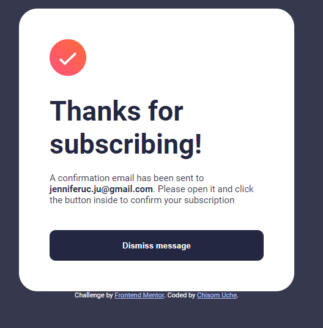

# Frontend Mentor - Newsletter sign-up form with success message solution

This is a solution to the [Newsletter sign-up form with success message challenge on Frontend Mentor](https://www.frontendmentor.io/challenges/newsletter-signup-form-with-success-message-3FC1AZbNrv). 

## Table of contents

- [Frontend Mentor - Newsletter sign-up form with success message solution](#frontend-mentor---newsletter-sign-up-form-with-success-message-solution)
  - [Table of contents](#table-of-contents)
  - [Overview](#overview)
    - [The challenge](#the-challenge)
    - [Screenshot](#screenshot)
    - [Links](#links)
  - [My process](#my-process)
    - [Built with](#built-with)
    - [What I learned](#what-i-learned)
    - [Continued development](#continued-development)
  - [Author](#author)
  

## Overview

The project is a responsive newsletter sign-up form with dynamic validation and a success message. The HTML document includes sections for user input and feedback, while the associated JavaScript code handles form submission, email validation, and success message display. Users receive real-time error messages for invalid inputs and are presented with a success message upon successful submission. A dismissible button in the success message allows users to clear the message and reload the page. Overall, the project combines form functionality with a clean and user-friendly interface.

### The challenge

Users should be able to:

- Add their email and submit the form
- See a success message with their email after successfully submitting the form
- See form validation messages if:
  - The field is left empty
  - The email address is not formatted correctly
- View the optimal layout for the interface depending on their device's screen size
- See hover and focus states for all interactive elements on the page

### Screenshot

### Links

- Solution URL: [Add solution URL here](https://your-solution-url.com)
- Live Site URL: [Add live site URL here](https://your-live-site-url.com)

## My process
Absolutely, let's simplify it:

**My Process: Creating a Newsletter Sign-up Form**

1. **Objective:**
   - Developed a responsive newsletter sign-up form with dynamic validation and a success message.

2. **Coding:**
   - Structured HTML for form and content, linked to external styles and fonts.
   - Styled the form with CSS for a clean and responsive layout.

3. **JavaScript Functionality:**
   - Implemented JavaScript for real-time form validation.
   - Created a success message that appears on a successful submission.

4. **Testing:**
   - Thoroughly tested the form's responsiveness and functionality.

5. **Refinement:**
   - Made adjustments based on testing feedback.
   - Ensured cross-browser compatibility.

6. **Attribution:**
   - Properly credited Frontend Mentor for the challenge.

7. **Documentation:**
   - Summarized the project overview, HTML, CSS, and JavaScript.

8. **Finalization:**
   - Reviewed for a user-friendly interface.

### Built with

- Semantic HTML5 markup
- CSS custom properties
- Flexbox
- CSS Grid
- Mobile-first workflow

### What I learned
In building the newsletter sign-up form, I learned and applied fundamental skills in HTML, CSS, and JavaScript. Key takeaways include creating a well-structured HTML document, implementing responsive design, incorporating real-time form validation with JavaScript, and enhancing user interaction through dynamic content updates. The project also emphasized the importance of testing, debugging, and proper documentation. Additionally, the experience enhanced my understanding of attribution and credits in web development, and the final step involved deploying the project for public access. Overall, the project provided a practical learning experience in frontend development.

### Continued development

Just to work more on responsive design media query

## Author

- Website - [Add your name here](https://www.your-site.com)
- Frontend Mentor - [@yourusername](https://www.frontendmentor.io/profile/yourusername)
- Twitter - [@yourusername](https://www.twitter.com/yourusername)
